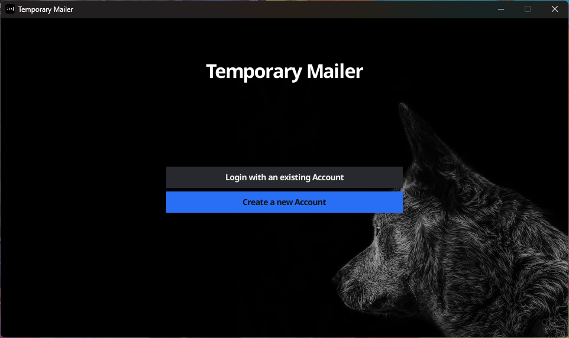
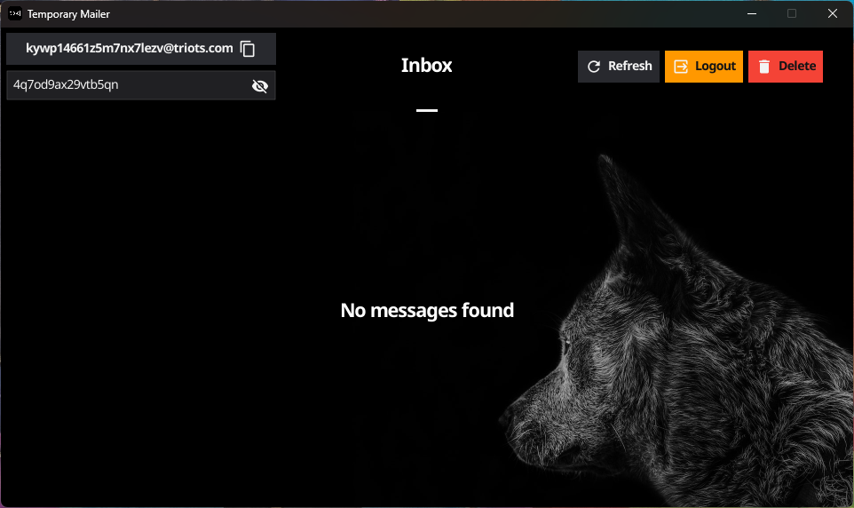

# Temporary-Mailer
Temp Mail is a GUI application that creates a temporary email using the mail.tm service

<p align="center">
  <br />
  
  &nbsp;&nbsp;&nbsp;&nbsp;
  

</p>

This application is built using the following packages:
- [fyne](https://github.com/fyne-io/fyne) (version 2.3.0 or later)
- [mailtm](github.com/felixstrobel/mailtm)
- [eventsource](github.com/donovanhide/eventsource)


## Features

- [x] Creates a temporary email
- [x] Login with an existing mail.tm email
- [x] Delete email
- [x] Auto updating Inbox using SSE
- [x] Works on Linux and Windows, should work on MacOS as well (not tested)
- [x] Dark theme

## Prerequisites

To compile and run, you will need to have Go installed on your machine. Refer to the [installation instructions](https://go.dev/doc/install).

## Install

```shell
go install github.com/rumourscape/temporary-mailer
```

## Run

```shell
temporary-mailer
```

## Build from Source

Temporary Mailer can be built for your operating system using [Fyne](https://fyne.io/). You’ll need to install it first:

```shell
go install fyne.io/fyne/v2/cmd/fyne@latest
```

Then clone this repository, and run the following command:

```shell
fyne package
```

A binary for your OS will be generated in the same directory.

## License

[GPL-3, see LICENSE](LICENSE)